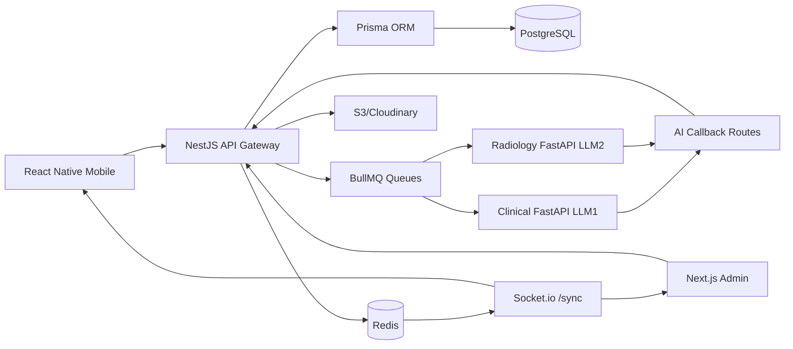
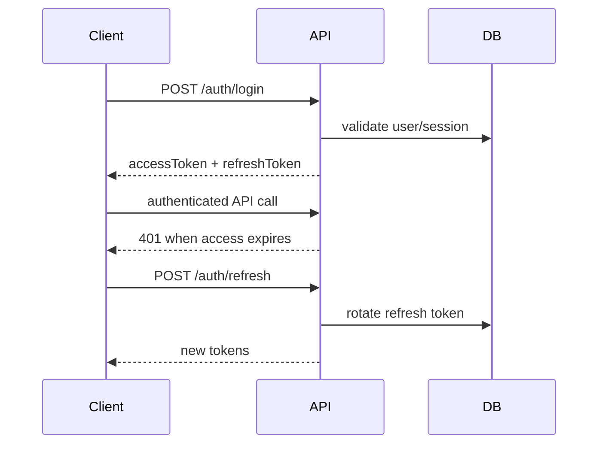
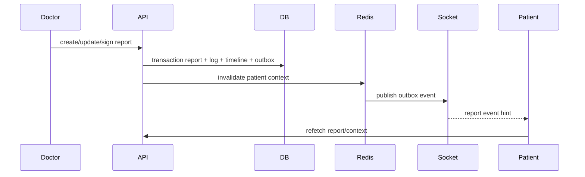
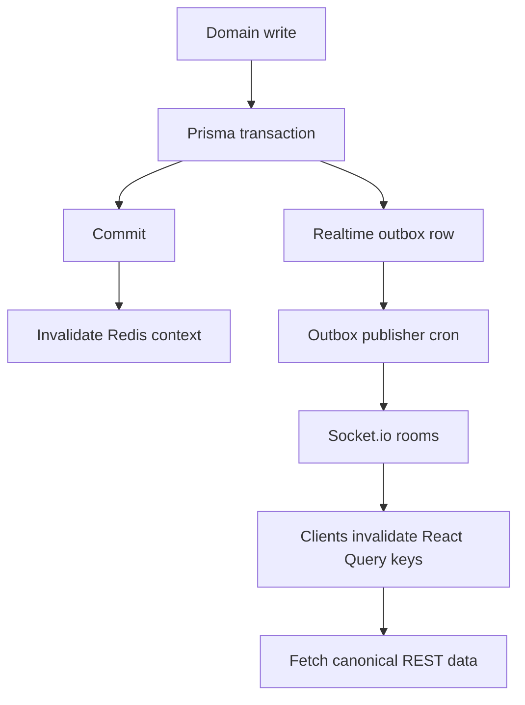

# SwasthAI Full System Integration Plan

## Non-Negotiable Source Of Truth

PostgreSQL is the only durable source of truth. Prisma is the only database write path. Redis is used for queues, websocket fanout, cache invalidation, pub/sub, OTP/session scratch data, and short-lived locks. React Native, Next.js, Socket.io clients, and AI workers must refetch canonical state from NestJS APIs after realtime events.

No clinical screen should render hardcoded patients, reports, appointments, scans, prescriptions, or AI outputs. Local stores may keep UI state, draft form state, active route state, and auth tokens only.

## Route Architecture

All REST routes are versioned under `/api/v1`.

### Auth And User Routes

| Method | Route | Roles | Purpose |
| --- | --- | --- | --- |
| POST | `/auth/signup` | Public | Doctor, nurse, patient signup. Doctors/nurses enter approval queue. |
| POST | `/auth/login` | Public | User login with approval enforcement. |
| POST | `/auth/admin/login` | Public | Env-backed admin login. |
| POST | `/auth/refresh` | Public | Refresh rotation and access token renewal. |
| POST | `/auth/logout` | Authenticated | Revoke current or all sessions. |
| POST | `/auth/otp/send` | Public | Redis-backed phone OTP issue. |
| POST | `/auth/otp/verify` | Public | Redis-backed phone OTP verification. |
| GET | `/users/me` | Authenticated | Current identity, role, and approval status. |

### Admin Routes

| Method | Route | Roles | Purpose |
| --- | --- | --- | --- |
| GET | `/admin/dashboard` | ADMIN | Live operational metrics. |
| GET | `/admin/approvals` | ADMIN | Doctor/nurse approval queue. |
| PATCH | `/admin/approvals/:id/approve` | ADMIN | Approve provider and emit realtime update. |
| PATCH | `/admin/approvals/:id/reject` | ADMIN | Reject provider with audit trail. |
| GET | `/admin/reports` | ADMIN | SOAP/radiology moderation surface. |
| GET | `/admin/ai-jobs` | ADMIN | Durable inference job monitor. |
| GET | `/admin/realtime/health` | ADMIN | Realtime outbox health. |
| GET | `/admin/hospitals` | ADMIN | Hospital network with live counts. |
| GET | `/audit/logs` | ADMIN | Clinical/admin audit trail. |
| GET | `/audit/logins` | ADMIN | Login audit trail. |

### Patient And Clinical Routes

| Method | Route | Roles | Purpose |
| --- | --- | --- | --- |
| GET | `/patients/search` | ADMIN, DOCTOR, NURSE | Full-text patient lookup. |
| GET | `/patients/:id/context` | ADMIN, assigned DOCTOR/NURSE, self PATIENT | Central medical context. |
| POST | `/consents` | DOCTOR | Grant AI consent for patient/consultation. |
| PATCH | `/consents/:id/revoke` | DOCTOR, PATIENT | Revoke AI consent. |
| POST | `/consultations` | DOCTOR | Start consultation. |
| GET | `/consultations/:id` | ADMIN, assigned care team, patient self | Full consultation view. |
| POST | `/consultations/:id/notes` | DOCTOR, NURSE | Versioned note write. |
| POST | `/consultations/:id/transcripts` | DOCTOR, NURSE | Live transcript chunk persistence. |
| POST | `/consultations/:id/vitals` | DOCTOR, NURSE | Persist vitals. |
| POST | `/consultations/:id/body-map` | DOCTOR, NURSE | Persist body map. |
| PATCH | `/consultations/:id/end` | DOCTOR, NURSE | Complete consultation. |

### Reports, Radiology, Files, Drug Safety, Appointments

| Method | Route | Roles | Purpose |
| --- | --- | --- | --- |
| POST | `/consultations/:id/soap-reports/generate-ai` | DOCTOR | Queue LLM1 SOAP generation. |
| POST | `/consultations/:id/soap-reports` | DOCTOR | Create human or AI-assisted SOAP report. |
| PATCH | `/consultations/soap-reports/:reportId/sign` | owning DOCTOR | Sign SOAP report. |
| GET | `/reports/patients/:patientProfileId` | authorized roles | Patient report bundle. |
| GET | `/reports/soap/:id` | authorized roles | SOAP detail and versions. |
| GET | `/reports/radiology/:id` | authorized roles | Radiology report detail. |
| POST | `/radiology/uploads` | ADMIN, DOCTOR, NURSE | Link registered scan file and optionally queue AI. |
| POST | `/radiology/uploads/:id/predictions` | authorized/internal | Store AI radiology prediction. |
| POST | `/radiology/uploads/:id/reports` | DOCTOR | Create radiology report. |
| POST | `/files/sign-upload` | authenticated | Secure upload signature/presigned URL. |
| POST | `/files` | authenticated | Register uploaded file metadata in PostgreSQL. |
| GET | `/drug-safety/medications` | DOCTOR, NURSE | Medication search. |
| POST | `/drug-safety/check` | DOCTOR, NURSE | Interaction/allergy/contraindication check. |
| POST | `/appointments` | authorized roles | Create appointment. |
| POST | `/appointments/ai-suggestions` | DOCTOR | AI-assisted follow-up suggestions. |
| POST | `/appointments/schedules` | provider/admin | Create provider schedule. |
| GET | `/appointments/providers/:providerId/schedule` | authenticated | Provider availability. |
| POST | `/appointments/:id/reminders` | authorized roles | Create reminder. |
| GET | `/notifications` | authenticated | User notifications. |
| PATCH | `/notifications/:id/read` | owner | Mark notification read. |

### AI Callback Routes

| Method | Route | Guard | Purpose |
| --- | --- | --- | --- |
| POST | `/ai/callbacks/soap-completed` | `x-internal-api-key` | LLM1 returns SOAP, symptoms, diagnosis suggestions, confidence. |
| POST | `/ai/callbacks/radiology-completed/:uploadId` | `x-internal-api-key` | LLM2 returns classification, heatmaps, contours, SHAP, confidence. |

## Frontend Integration

### React Native Mobile

- `services/httpClient.js` owns Axios, access token injection, refresh rotation, normalized errors, and retry for idempotent reads.
- `services/queryClient.js` owns server-state cache keys and realtime invalidation.
- `services/realtimeClient.js` connects to Socket.io namespace `/sync`.
- `hooks/useRealtimeSync.js` subscribes to active patient and consultation rooms.
- Zustand stores keep only auth/session/UI/draft state.
- Clinical state must come from React Query backed by NestJS APIs.

Mobile navigation is protected by auth state plus role and approval status:

| Route group | Role |
| --- | --- |
| `(doctor)` | approved DOCTOR |
| `(nurse)` | approved NURSE |
| `(patient)` | PATIENT |
| `onboarding/pending` | pending DOCTOR/NURSE |

### Next.js Admin

- `src/lib/api-client.js` owns Axios, admin token injection, cookies, refresh retry, and error normalization.
- `src/lib/query-client.jsx` owns admin cache keys.
- `src/lib/realtime-client.jsx` subscribes to `/sync` and invalidates admin queries after events.
- `src/components/admin/live-admin-section.jsx` renders dashboard, approvals, AI jobs, realtime health, hospitals, and audit logs from live APIs.

## Realtime Synchronization

Socket.io namespace: `/sync`.

Rooms:

| Room | Members |
| --- | --- |
| `user:{userId}` | One authenticated user. |
| `role:{role}` | All users with a role. |
| `patient:{patientProfileId}` | Patient, assigned doctor/nurse, admin. |
| `consultation:{consultationId}` | Active consultation participants. |
| `admin:approvals` | Admin approval console. |

Events:

| Event | Trigger |
| --- | --- |
| `admin.approval.created` | Provider signup enters approval queue. |
| `admin.approval.updated` | Admin approves/rejects provider. |
| `consultation.started` | Doctor starts consultation. |
| `consultation.note.saved` | Doctor/nurse saves versioned note. |
| `consultation.transcript.updated` | Transcript chunk persisted. |
| `patient.vitals.updated` | Nurse/doctor adds vitals. |
| `consultation.body_map.updated` | Body map updated. |
| `report.soap.updated` | SOAP report created or amended. |
| `report.soap.signed` | Doctor signs SOAP report. |
| `ai.soap.queued` | LLM1 job queued. |
| `ai.soap.running` | LLM1 job submitted to model API. |
| `ai.soap.completed` | LLM1 callback persisted. |
| `ai.soap.failed` | LLM1 submission or callback failed. |
| `radiology.upload.created` | Scan file linked to patient. |
| `ai.radiology.running` | LLM2 job submitted to model API. |
| `radiology.ai.completed` | LLM2 callback persisted. |
| `radiology.report.updated` | Radiology report created/amended. |
| `file.registered` | File metadata registered in PostgreSQL. |
| `notification.created` | Notification persisted. |

Event payloads are invalidation hints. Clients must refetch canonical data from REST APIs.

## Database Synchronization

Every medical write follows this transaction shape:

1. Validate RBAC and patient access.
2. Write domain row through Prisma.
3. Write version/audit/timeline/search rows.
4. Insert `realtime_event_outbox` row in the same transaction.
5. Commit.
6. Invalidate Redis patient context cache.
7. Outbox publisher emits Socket.io events.
8. Clients invalidate query keys and refetch.

Consistency rules:

- One SOAP version per consultation version number.
- One radiology report version per upload version number.
- File bytes never enter PostgreSQL; only `file_objects` metadata does.
- AI jobs are durable in `ai_processing_jobs` before Redis queue submission.
- AI callbacks must be idempotent by `jobId` or `uploadId`.
- Report signing is doctor-owned and auditable.

## Role Access Matrix

| Capability | ADMIN | DOCTOR | NURSE | PATIENT |
| --- | --- | --- | --- | --- |
| Approve doctors/nurses | Yes | No | No | No |
| Manage hospitals | Yes | No | No | No |
| View audit logs | Yes | No | No | No |
| Monitor AI jobs | Yes | Assigned patients | Assigned patients | Own jobs only by report context |
| Search patients | Yes | Yes | Yes | No |
| View patient context | Yes | Assigned/consented | Assigned | Self |
| Start consultation | No | Yes | No | No |
| Add vitals | Yes | Assigned | Assigned | No |
| Save notes | Yes | Assigned | Assigned | No |
| Generate SOAP with AI | No | Assigned with consent | No | No |
| Sign SOAP | No | Owning doctor | No | No |
| Upload scan | Yes | Assigned | Assigned | Patient upload route planned |
| Review radiology | Yes | Assigned doctor | Read/support | Own report |
| Check drug safety | No | Yes | Support | No |
| Book appointment | Yes | Yes | Yes | Self |
| Read notifications | Own | Own | Own | Own |

## Report Consistency Engine

Lifecycle:

`DRAFT -> AI_GENERATED -> UNDER_REVIEW -> SIGNED -> AMENDED -> ARCHIVED`

Write behavior:

- Create reports through consultation/radiology services only.
- Store every change in `report_change_logs`.
- Append patient timeline events for report creation, AI completion, signing, and amendment.
- Upsert `search_documents` for report retrieval and AI context.
- Invalidate `patient:context:{patientProfileId}` after every report mutation.
- Emit `report.soap.updated`, `report.soap.signed`, or `radiology.report.updated`.

Caching:

- Redis patient context TTL: 60 seconds.
- Frontend query stale time: 30 seconds.
- Realtime event immediately invalidates patient context, consultation, reports, and notifications keys.

## File Storage Integration

Upload flow:

1. Client calls `POST /files/sign-upload`.
2. Client uploads directly to S3 or Cloudinary.
3. Client calls `POST /files` with provider metadata.
4. Backend writes `file_objects`, emits `file.registered`, and invalidates patient context.
5. Domain service links the file to radiology, report PDF, verification document, audio, or overlay.

Supported categories:

- `XRAY`, `CT_SCAN`, `MRI_SCAN`, `ULTRASOUND`
- `AUDIO_RECORDING`
- `RADIOLOGY_OVERLAY`
- `GENERATED_REPORT`
- `VERIFICATION_DOCUMENT`
- `CLINICAL_ATTACHMENT`

## ML Model API Integration

The models are deployed separately. SwasthAI integrates through the NestJS AI gateway and BullMQ workers.

Required environment:

- `FASTAPI_CLINICAL_URL`
- `FASTAPI_CLINICAL_API_KEY` or `FASTAPI_CLINICAL_BEARER_TOKEN`
- `FASTAPI_CLINICAL_SOAP_PATH`
- `FASTAPI_RADIOLOGY_URL`
- `FASTAPI_RADIOLOGY_API_KEY` or `FASTAPI_RADIOLOGY_BEARER_TOKEN`
- `FASTAPI_RADIOLOGY_PATH`
- `AI_CALLBACK_BASE_URL`
- `AI_SERVICE_API_KEY`

### LLM1 Clinical Flow

Input:

- audio transcript chunks
- doctor notes
- consultation text
- patient context

Output:

- transcript
- SOAP draft
- symptoms
- diagnosis suggestions
- confidence

Flow:

1. Doctor captures consent.
2. Mobile writes notes/transcripts to NestJS.
3. Doctor calls `/consultations/:id/soap-reports/generate-ai`.
4. Backend creates `ai_processing_jobs` row and Redis job.
5. BullMQ worker posts to FastAPI clinical endpoint with callback URL.
6. FastAPI calls `/ai/callbacks/soap-completed`.
7. Backend creates SOAP report, AI insight, timeline event, audit log, and outbox event.
8. Doctor, nurse, patient, and admin clients refetch.

### LLM2 Radiology Flow

Input:

- X-ray, CT, MRI file metadata and signed storage URL
- scan type
- patient context

Output:

- classification
- heatmaps
- contours
- segmentation masks
- SHAP explainability
- confidence scores

Flow:

1. Scan file is uploaded to S3/Cloudinary and registered in `file_objects`.
2. Client calls `/radiology/uploads` with `queueAi=true`.
3. Backend creates `radiology_uploads` and `ai_processing_jobs`.
4. BullMQ worker submits to FastAPI radiology endpoint.
5. FastAPI uploads overlay outputs, registers/returns file IDs, and calls callback.
6. Backend persists `ai_predictions`, overlays, `ai_insights`, and outbox events.
7. All connected systems refetch patient context and radiology reports.

Failure handling:

- request timeout uses `AI_REQUEST_TIMEOUT_MS`
- submit retries use exponential backoff
- final failure updates `ai_processing_jobs.status=FAILED`
- failure event is broadcast to admin and patient/consultation rooms
- source files and notes remain preserved for manual review

## Security

- Short-lived JWT access tokens.
- Hashed, rotated refresh tokens.
- HTTP-only cookies for web admin.
- Bearer tokens for mobile.
- `JwtAuthGuard`, `ApprovalGuard`, and `RolesGuard` on protected APIs.
- `InternalApiKeyGuard` on AI callbacks.
- Signed upload URLs.
- No PHI in model URLs or logs.
- Admin login is env-backed, not self-signup.
- Redis OTPs are hashed and short-lived.
- API keys live in env/secrets, never client bundles.

## Project Structure

```text
apps/
  mobile/
    app/                      Expo routes by role
    services/httpClient.js     Axios + refresh + retries
    services/queryClient.js    React Query keys and realtime invalidation
    services/realtimeClient.js Socket.io client
    hooks/useRealtimeSync.js   Patient/consultation subscriptions
    store/                     Auth/UI/draft Zustand stores only
  web-admin/
    src/app/providers.jsx
    src/lib/api-client.js
    src/lib/admin-api.js
    src/lib/query-client.jsx
    src/lib/realtime-client.jsx
    src/components/admin/live-admin-section.jsx
services/
  api-gateway/
    src/auth/
    src/admin/
    src/patients/
    src/consultations/
    src/reports/
    src/radiology/
    src/files/
    src/drug-safety/
    src/appointments/
    src/notifications/
    src/realtime/
    src/jobs/
    src/ai/
packages/
  database/prisma/schema.prisma
  types/
  api-client/
  auth/
  validation/
```

## Final System Flows

### Dependency Graph



### Authentication Flow



### Report Synchronization Flow



### Realtime Event Rule


