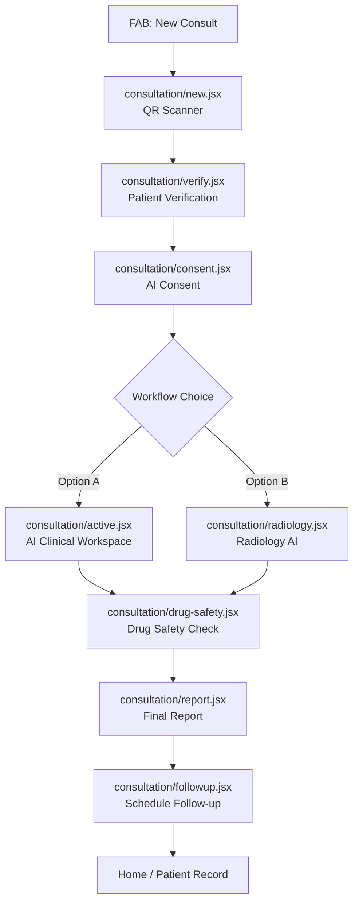
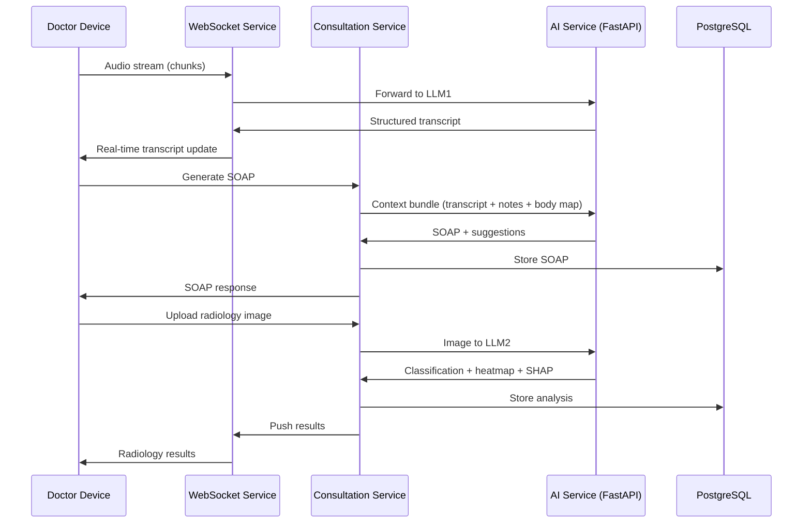

# SwasthAI Core Feature Page — Implementation Plan

> Build the central AI-native doctor workflow: Patient Scan → Verification → Consent → AI Consultation / Radiology → Drug Safety → Report → Follow-up

---

## Current State Assessment

After thorough codebase analysis, here's what exists:

| Layer | Status | Details |
|-------|--------|---------|
| **Mobile App** | ✅ Foundation built | Expo Router, doctor layout, home screen, bottom bar with FAB, auth flow |
| **Design System** | ✅ Fully defined | `doctorTheme.js`, `COLOR_SYSTEM.md`, `DESIGN.md`, `tailwind.config.js` — premium purple palette |
| **Auth & RBAC** | ✅ Complete | `authStore.js`, `permissions.js`, role-based routing, verification states |
| **Consultation Store** | ⚠️ Skeleton only | Basic Zustand store with session/SOAP/drugFlags — needs massive expansion |
| **Consultation Screens** | ❌ Placeholder only | `new.jsx` and `active.jsx` are empty shells |
| **Backend Services** | ❌ Scaffold only | 12 service directories with empty `package.json` files |
| **Database** | ❌ Not started | Empty `packages/database` |
| **AI Integration** | ❌ Not started | Empty `packages/ai-sdk` and `services/ai-service` |

---

## User Review Required

> [!IMPORTANT]
> **Phased delivery**: This is a ~40-file, ~8000+ line implementation. I recommend building in 4 phases to keep reviews manageable. Phase 1 (frontend screens + stores + mock services) is the immediate deliverable. Phases 2-4 (backend, database, AI pipelines) follow once Phase 1 is validated on device.

> [!WARNING]
> **Mock-first strategy**: Since backend services are scaffolds, all API calls will use production-shaped mock services (same pattern as existing `authService.js`). This means the frontend is fully functional for demos while backends are built in parallel.

> [!IMPORTANT]
> **No new dependencies added in Phase 1**: The implementation uses only packages already in `package.json` (Reanimated, Gesture Handler, Zustand, Haptics, Ionicons, etc.). If `expo-camera` / `expo-barcode-scanner` are needed for QR, they'll require `expo install` — confirming this is acceptable.

---

## Open Questions

> [!IMPORTANT]
> 1. **QR Scanner**: Should I use `expo-camera` with barcode scanning, or `expo-barcode-scanner` (deprecated in favor of expo-camera)? I recommend `expo-camera` with `BarcodeScanner` type.
> 2. **Body Map SVG**: Should I use `react-native-svg` for the interactive body visualization, or a pre-rendered image with touch hitboxes? I recommend SVG for precision.
> 3. **Audio pipeline**: For LLM1 voice transcription, should I stub the audio capture with `expo-av` and send chunks to a mock WebSocket, or skip audio entirely in Phase 1 and show pre-filled transcription? I recommend the mock WebSocket approach for demo impact.
> 4. **DICOM viewer**: Full DICOM parsing requires `cornerstone.js` or similar. For Phase 1, should I support PNG/JPG only with DICOM as a future milestone? I recommend PNG/JPG + DICOM metadata extraction only.
> 5. **PDF generation**: Should reports use `react-native-pdf` for viewing and a server-side PDF generator, or client-side with `expo-print`? I recommend `expo-print` for Phase 1.

---

## Proposed Changes

### Phase 1: Frontend — Screens, Components, Stores, Mock Services

This is the primary deliverable. Everything below ships together.

---

### 1. Expo Router Screen Architecture

The consultation flow uses a **step-based navigation** within the `(doctor)/consultation/` route group, keeping it inside the existing doctor layout shell.

#### Screen Flow Diagram



#### [MODIFY] [_layout.jsx](file:///d:/CodeVault/Project_X/SwasthAi/apps/mobile/app/(doctor)/consultation/_layout.jsx)
- **NEW FILE** — Create a `Stack` layout for the consultation flow with custom transitions (slide-up for modals, fade for workspace)

#### [MODIFY] [new.jsx](file:///d:/CodeVault/Project_X/SwasthAi/apps/mobile/app/(doctor)/consultation/new.jsx)
- **Complete rewrite**: Fullscreen QR scanner with animated frame, edge glow, scan success animation, manual ID fallback
- Uses `expo-camera` with barcode detection
- Animated scanner crosshairs with Reanimated
- Low-light torch toggle
- After scan → navigate to `verify`

#### [NEW] verify.jsx
`apps/mobile/app/(doctor)/consultation/verify.jsx`
- Patient demographics card with confidence animation
- Fetched data: age, blood group, allergies, chronic diseases, reports, medications, scans, emergency contacts
- Animated "Verified ✓" badge with encrypted shield icon
- Trust score indicator (animated arc)
- "Continue" CTA with glow

#### [MODIFY] [active.jsx](file:///d:/CodeVault/Project_X/SwasthAi/apps/mobile/app/(doctor)/consultation/active.jsx)
- **Complete rewrite**: The main AI Clinical Workspace
- **Mobile-optimized layout**: Since this is React Native (not web), the 3-panel layout becomes a **tabbed workspace** with swipeable panels:
  - Tab 1: **Patient Timeline** (left panel equivalent)
  - Tab 2: **Live Notes** (center panel — default active)
  - Tab 3: **AI Insights + SOAP** (right panel)
- Bottom action bar: voice controls, quick tags, body map toggle
- Floating AI status indicator (listening/processing/ready)

#### [NEW] consent.jsx
`apps/mobile/app/(doctor)/consultation/consent.jsx`
- Consent modal with checkboxes
- Full consent text (AI diagnostics, encrypted processing, doctor supervision)
- Legal timestamp capture
- Cannot proceed without all checkboxes
- Animated shield + lock icons

#### [NEW] radiology.jsx
`apps/mobile/app/(doctor)/consultation/radiology.jsx`
- Upload experience: drag-drop zone, multi-image, progress bars
- Image preview with metadata extraction
- LLM2 analysis trigger → loading state → results
- Side-by-side comparison, heatmap overlay slider
- SHAP explainability cards
- Structured findings editor

#### [NEW] drug-safety.jsx
`apps/mobile/app/(doctor)/consultation/drug-safety.jsx`
- Prescription input with drug search
- Real-time safety checks: allergies, interactions, dosage, pregnancy/age risks
- Severity indicators (red/yellow/green)
- Alternative medicine suggestions
- Interaction explanation cards

#### [NEW] report.jsx
`apps/mobile/app/(doctor)/consultation/report.jsx`
- Unified report view: SOAP + prescriptions + imaging + AI insights + body map + warnings
- Editable sections
- PDF export trigger
- Doctor sign-off button
- Version history toggle

#### [NEW] followup.jsx
`apps/mobile/app/(doctor)/consultation/followup.jsx`
- Calendar picker with AI-suggested dates
- Urgency recommendations
- Reminder type selection (SMS/email/push)
- Confirmation animation

---

### 2. Component Library (New Components)

All components follow existing patterns: `doctorTheme as t`, `StyleSheet`, Reanimated animations, Ionicons.

#### [NEW] `components/consultation/` directory

| Component | Purpose |
|-----------|---------|
| `QRScannerOverlay.jsx` | Animated scanner frame with edge glow, torch button, manual entry link |
| `PatientVerifyCard.jsx` | Demographics display with confidence animation, encrypted badge |
| `ConsentModal.jsx` | Checkbox list + legal text + timestamp capture |
| `WorkflowSelector.jsx` | Option A / Option B choice with animated cards |
| `PatientTimeline.jsx` | Scrollable history: visits, meds, scans, AI flags |
| `LiveNotesEditor.jsx` | Rich text input with auto-save, tags, structured sections |
| `VoiceControlBar.jsx` | Mic toggle, waveform, speaker indicator, language selector |
| `TranscriptionFeed.jsx` | Real-time transcript with speaker labels, medical entity highlights |
| `BodyMapView.jsx` | Interactive SVG human body (front/back toggle), tap-to-mark, heat markers |
| `SOAPPanel.jsx` | S/O/A/P sections, editable, AI confidence scores, export button |
| `ClinicalSuggestions.jsx` | AI condition suggestions with confidence %, evidence cards, differential diagnosis |
| `RadiologyUploader.jsx` | Multi-image upload with progress, preview, metadata |
| `RadiologyResults.jsx` | Heatmap overlay, confidence meter, contour rendering, layer toggles |
| `SHAPExplainability.jsx` | Why AI predicted this — feature importance, uncertainty analysis |
| `DrugSafetyPanel.jsx` | Drug search, interaction checker, severity badges, alternatives |
| `ReportBuilder.jsx` | Unified report assembly, section editor, PDF trigger |
| `FollowUpScheduler.jsx` | Calendar + AI suggestions + reminder config |
| `AIStatusIndicator.jsx` | Floating pulse dot showing AI state (listening/processing/ready/error) |
| `ConfidenceMeter.jsx` | Animated arc/gauge for trust scores |
| `HeatMarker.jsx` | SVG circle with color intensity mapping for body map pain points |

---

### 3. Zustand Store Architecture

#### [MODIFY] [consultationStore.js](file:///d:/CodeVault/Project_X/SwasthAi/apps/mobile/store/consultationStore.js)
- **Major expansion** — the existing skeleton becomes the central state hub

```
consultationStore shape:
├── Session
│   ├── sessionId, status, startedAt, workflowType
│   ├── doctorId, patientId
│   └── consentCaptured, consentTimestamp, consentVersion
├── Patient (fetched)
│   ├── demographics, allergies, chronicDiseases
│   ├── activeMediactions, previousReports, scanHistory
│   ├── emergencyContacts, aiHistory, doctorHistory
│   └── verificationConfidence
├── Transcription
│   ├── isListening, transcript[], speakerLabels
│   ├── medicalEntities[], symptoms[], medications[]
│   └── streamBuffer
├── Notes
│   ├── doctorNotes, quickTags[], urgentItems[]
│   ├── autoSaveStatus, lastSavedAt
│   └── mergedContext (voice + typed)
├── BodyMap
│   ├── markers[] (position, severity, type, radius)
│   └── activeView ('front' | 'back')
├── SOAP
│   ├── subjective, objective, assessment, plan
│   ├── aiConfidence, isGenerated, isEdited
│   └── exportReady
├── ClinicalSuggestions
│   ├── conditions[], treatments[], tests[]
│   ├── risks[], differentialDiagnosis[]
│   └── evidenceLinks[]
├── Radiology
│   ├── uploads[] (uri, status, metadata)
│   ├── analysisResults (classification, anomalies, severity)
│   ├── heatmapData, segmentationMasks
│   ├── shapExplanation
│   └── radiologyReport
├── DrugSafety
│   ├── prescriptions[]
│   ├── interactions[], alerts[]
│   ├── alternatives[]
│   └── safetyScore
├── Report
│   ├── sections, status, versionHistory[]
│   ├── pdfUri, signedOff
│   └── syncStatus
└── FollowUp
    ├── scheduledDate, urgency, reminderType
    └── aiSuggestions[]
```

#### [NEW] `store/radiologyStore.js`
- Separated for performance — radiology uploads/analysis are heavy and shouldn't trigger re-renders on SOAP updates

#### [NEW] `store/drugSafetyStore.js`
- Drug interaction checking state, prescription list, safety scores

---

### 4. Service Layer (Mock-first, Production-shaped)

#### [NEW] `services/consultationService.js`
- `startSession(doctorId, patientId)` → creates session
- `fetchPatientData(patientId | qrPayload)` → demographics, history
- `captureConsent(sessionData)` → stores consent record
- `endSession(sessionId)` → finalizes

#### [NEW] `services/aiService.js`
- `startTranscription(sessionId)` → WebSocket mock
- `stopTranscription(sessionId)` → returns final transcript
- `generateSOAP(context)` → SOAP note generation
- `getClinicalSuggestions(context)` → conditions, treatments
- `analyzeImage(imageUri, type)` → radiology analysis
- `getSHAPExplanation(predictionId)` → explainability

#### [NEW] `services/drugSafetyService.js`
- `checkInteractions(drugs[], patientProfile)` → safety report
- `searchDrug(query)` → drug database search
- `getAlternatives(drugId, reason)` → safe alternatives

#### [NEW] `services/reportService.js`
- `generateReport(sessionId)` → unified report
- `exportPDF(reportId)` → PDF generation
- `signOff(reportId, doctorId)` → doctor approval

#### [NEW] `services/appointmentService.js`
- `getAISuggestions(patientId, diagnosis)` → follow-up dates
- `scheduleAppointment(data)` → booking
- `setReminder(appointmentId, type)` → notification setup

---

### 5. Database Schema (Prisma)

#### [NEW] `packages/database/prisma/schema.prisma`

Key models (15+ tables):

| Model | Purpose |
|-------|---------|
| `ConsultationSession` | Main session record linking doctor, patient, workflow type |
| `PatientConsent` | Timestamped consent with device info, IP, version, session |
| `Transcription` | Audio transcription records with speaker labels |
| `ClinicalNote` | Doctor-typed notes with tags, auto-save versions |
| `BodyMapMarker` | Pain point coordinates, severity, type, linked to session |
| `SOAPNote` | S/O/A/P sections with AI confidence, edit history |
| `ClinicalSuggestion` | AI-generated suggestions with confidence, evidence |
| `RadiologyUpload` | Image uploads with metadata, processing status |
| `RadiologyAnalysis` | AI analysis results, heatmap data, SHAP explanation |
| `Prescription` | Drug prescriptions linked to session |
| `DrugInteraction` | Safety check results, severity, alternatives |
| `ConsultationReport` | Unified report with version history, sign-off status |
| `FollowUpAppointment` | Scheduled follow-ups with reminders |
| `AuditLog` | HIPAA-style audit trail for all actions |
| `ConsentVersion` | Versioned consent text templates |

---

### 6. Backend API Structure

#### [NEW] `services/consultation-service/src/`

NestJS modules:

```
consultation-service/
├── src/
│   ├── session/        — CRUD for consultation sessions
│   ├── consent/        — Consent capture and verification middleware
│   ├── transcription/  — Audio stream processing, WebSocket gateway
│   ├── notes/          — Clinical notes CRUD with auto-save
│   ├── body-map/       — Body marker CRUD
│   ├── soap/           — SOAP generation endpoint (calls AI service)
│   ├── radiology/      — Image upload, analysis trigger, results
│   ├── drug-safety/    — Interaction checking, prescription management
│   ├── report/         — Report generation, PDF export, sign-off
│   ├── appointment/    — Follow-up scheduling
│   └── common/         — Guards, interceptors, DTOs
```

#### [NEW] `services/ai-service/src/`

FastAPI microservice:

```
ai-service/
├── src/
│   ├── llm1/           — Clinical LLM: transcription structuring, SOAP, suggestions
│   ├── llm2/           — Radiology LLM: image analysis, segmentation, SHAP
│   ├── drug_engine/    — Drug interaction database + checking logic
│   ├── models/         — Model loading, inference management
│   └── common/         — Health checks, auth middleware
```

---

### 7. WebSocket Architecture

#### [NEW] `services/websocket-service/src/`

Channels:

| Channel | Purpose |
|---------|---------|
| `transcription:{sessionId}` | Real-time audio transcription stream |
| `soap:{sessionId}` | Live SOAP generation updates |
| `suggestions:{sessionId}` | Clinical suggestions as they arrive |
| `radiology:{uploadId}` | Image analysis progress and results |
| `drug-safety:{sessionId}` | Real-time interaction alerts |
| `sync:{sessionId}` | Session state sync across devices |

---

### 8. AI Inference Flow



---

### 9. Animation Strategy

All animations use the existing pattern: `Animated` API from React Native (as used in `home.jsx`) + Reanimated for gesture-driven animations.

| Animation | Technique | Duration |
|-----------|-----------|----------|
| QR scanner crosshair pulse | `Animated.loop` + `scale` | 1.2s cycle |
| QR edge glow | `Animated.loop` + `opacity` | 0.8s cycle |
| Scan success checkmark | `Animated.spring` + `scale` | 400ms |
| Patient verify confidence arc | `Animated.timing` + SVG path | 1.5s ease-out |
| Consent shield glow | `Animated.loop` + `opacity` | 2s cycle |
| Workflow card selection | `Animated.spring` + `scale` + `borderColor` | 300ms |
| Workspace tab switch | Gesture Handler swipe + `translateX` | 250ms |
| Voice waveform bars | `Animated.loop` + random `height` | 150ms per bar |
| AI status pulse | Reanimated `withRepeat` + `scale` | 1.5s cycle |
| Body map marker drop | `Animated.spring` + `scale` from 0 | 350ms |
| SOAP section expand | `LayoutAnimation` | 300ms |
| Drug alert slide-in | `Animated.timing` + `translateY` | 400ms |
| Report section fade-in | `Animated.stagger` + `opacity` | 80ms stagger |
| Follow-up confirmation | `Animated.sequence` (scale + opacity) | 600ms |

---

### 10. Folder Structure (Final)

```
apps/mobile/
├── app/
│   └── (doctor)/
│       └── consultation/
│           ├── _layout.jsx          ← Stack navigator for flow
│           ├── new.jsx              ← QR Scanner
│           ├── verify.jsx           ← Patient Verification
│           ├── consent.jsx          ← AI Consent
│           ├── active.jsx           ← AI Clinical Workspace (Option A)
│           ├── radiology.jsx        ← Radiology AI (Option B)
│           ├── drug-safety.jsx      ← Drug Safety Engine
│           ├── report.jsx           ← Final Report
│           └── followup.jsx         ← Follow-up Scheduling
├── components/
│   └── consultation/
│       ├── QRScannerOverlay.jsx
│       ├── PatientVerifyCard.jsx
│       ├── ConsentModal.jsx
│       ├── WorkflowSelector.jsx
│       ├── PatientTimeline.jsx
│       ├── LiveNotesEditor.jsx
│       ├── VoiceControlBar.jsx
│       ├── TranscriptionFeed.jsx
│       ├── BodyMapView.jsx
│       ├── SOAPPanel.jsx
│       ├── ClinicalSuggestions.jsx
│       ├── RadiologyUploader.jsx
│       ├── RadiologyResults.jsx
│       ├── SHAPExplainability.jsx
│       ├── DrugSafetyPanel.jsx
│       ├── ReportBuilder.jsx
│       ├── FollowUpScheduler.jsx
│       ├── AIStatusIndicator.jsx
│       ├── ConfidenceMeter.jsx
│       └── HeatMarker.jsx
├── store/
│   ├── consultationStore.js         ← Major expansion
│   ├── radiologyStore.js            ← NEW
│   └── drugSafetyStore.js           ← NEW
├── services/
│   ├── consultationService.js       ← NEW
│   ├── aiService.js                 ← NEW
│   ├── drugSafetyService.js         ← NEW
│   ├── reportService.js             ← NEW
│   └── appointmentService.js        ← NEW
└── constants/
    └── medicalConstants.js          ← NEW (body regions, drug categories, SOAP templates)
```

```
packages/database/
├── prisma/
│   └── schema.prisma                ← NEW — Full schema
└── package.json

services/consultation-service/
├── src/
│   ├── session/
│   ├── consent/
│   ├── transcription/
│   ├── notes/
│   ├── body-map/
│   ├── soap/
│   ├── radiology/
│   ├── drug-safety/
│   ├── report/
│   └── appointment/
└── package.json

services/ai-service/
├── src/
│   ├── llm1/
│   ├── llm2/
│   ├── drug_engine/
│   └── models/
└── package.json
```

---

## Execution Phases

### Phase 1 — Frontend (THIS PHASE)
**~40 files, ~8000 lines**
1. Consultation flow layout + all 8 screens
2. All 20 components
3. 3 Zustand stores (expanded + new)
4. 5 mock services
5. Medical constants
6. All animations

### Phase 2 — Database & Backend Foundation
1. Prisma schema (15+ models)
2. NestJS consultation service (10 modules)
3. API routes + DTOs + guards

### Phase 3 — AI Integration
1. FastAPI AI service (LLM1 + LLM2 stubs)
2. WebSocket service (6 channels)
3. Real audio pipeline integration

### Phase 4 — Production Hardening
1. HIPAA encryption layer
2. Audit logging
3. Real-time sync
4. Offline support
5. PDF generation
6. Performance optimization

---

## Verification Plan

### Automated Tests
- Run `npx expo start` to verify no import/build errors
- Navigate through entire consultation flow on device/emulator
- Verify all animations render at 60fps
- Test gesture interactions (body map, tab swiping, drag)

### Manual Verification
- Visual QA against `COLOR_SYSTEM.md` — every color must match
- Screen recording of full flow for demo readiness
- Test on both iOS and Android for platform consistency
- Verify haptic feedback on physical device
- Test edge cases: empty patient data, no camera permission, network timeout

---

> [!TIP]
> **Demo Strategy**: With mock services, the entire flow will be demo-ready immediately. Mock data is crafted to feel realistic (Indian patient names, real medical conditions, believable AI confidence scores). This means you can show investors the full flow before any backend is built.
